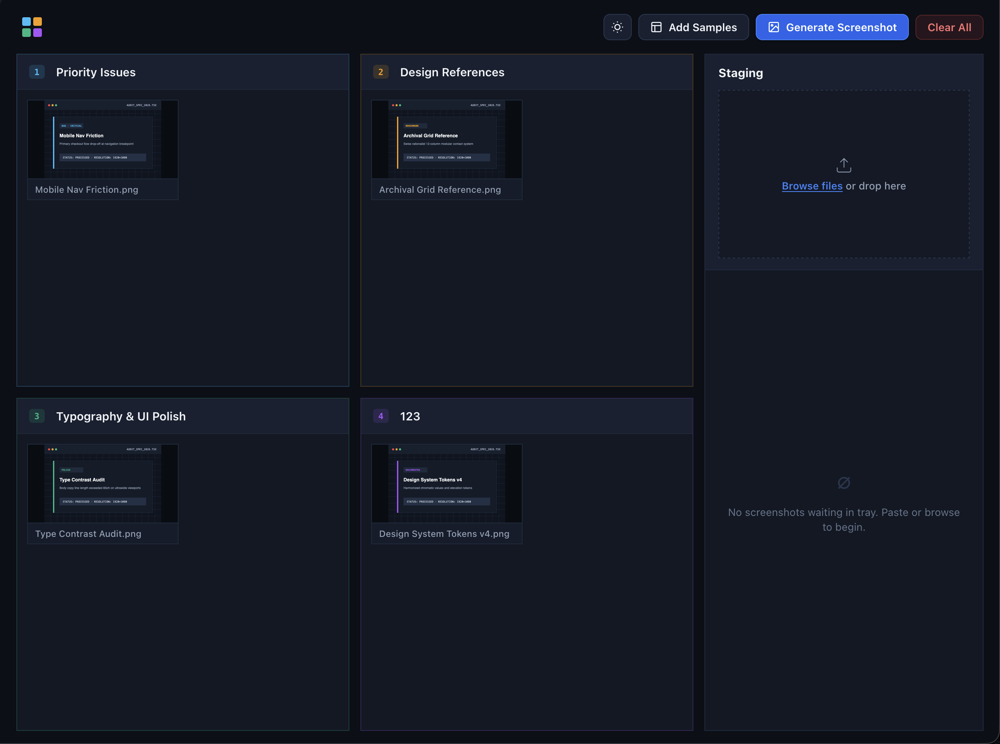
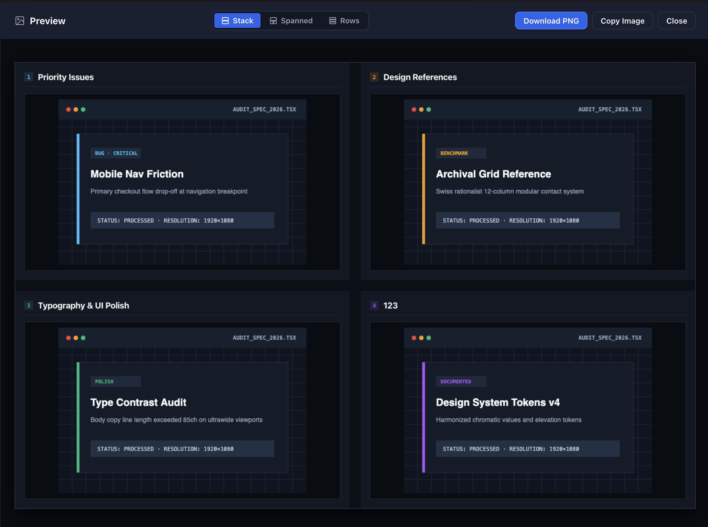

# Screenshot Labels

This is a small web app where you can upload a few images, then put them into one of four buckets with a specific label.

Then you can create a new image from those labeled buckets.

Buckets:

Image preview:

